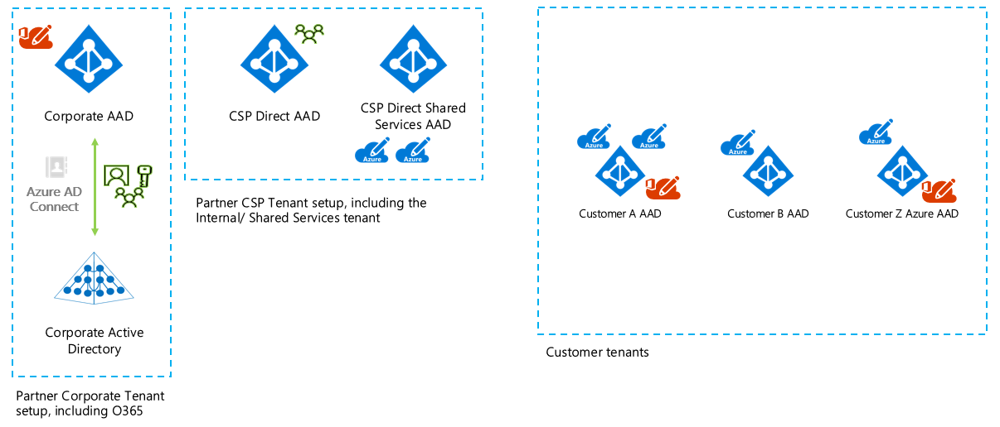
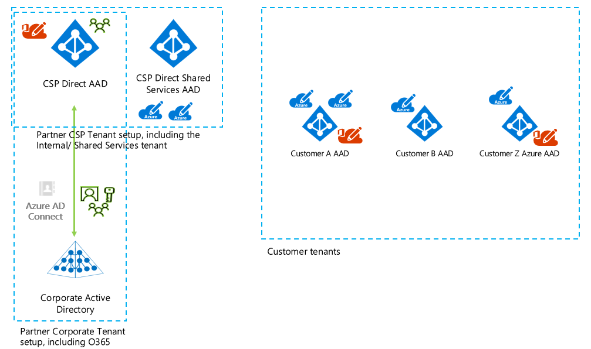

# CSP Delegation of Administration

## Introduction

This article will focus on how a CSP Direct partner can delegate administration across its customers. First we will provide an overview of the AAD tenants that play a part in this story. There are two common setups commonly faced:

* The CSP Direct partner has a separate AAD tenant for corporate and for CSP.



* The CSP Direct partner has a shared AAD tenant for corporate and for CSP.



In those diagrams we see there are various Azure Active Directory (AAD) tenants in play:

* **Corporate AAD**: used by the CSP partner to use O365 for his own employees (for example)
* **CSP Direct AAD**: used by the CSP partner to manage their customers in Partner Center
* **CSP Direct Shared Services AAD** *: used by the CSP partner for [Azure partner shared services](https://docs.microsoft.com/en-us/azure/cloud-solution-provider/overview/partner-shared-services)
* **Customer AAD**: used by the customer to access O365 and/or Azure subscriptions

The only difference between both setups is that some CSP partners have only one AAD for both corporate use and CSP customer management. The remainder of the article below applies for both setups.

The Shared Services AAD tenant and the Azure subscriptions linked to that are out of scope for this article. The idea of this article is to clearly describe what options there are for a CSP Direct partner to delegate access for it's staff to their customers O365 and Azure Subscriptions.

## Delegation of Administration

The concept of delegation of administration is to allow a certain group of people, e.g. a team at the CSP partner, manage customers their Azure and O365 services. For smaller organisations it might be fine if a staff employee is either an admin or not. Especially if there's only a limited amount of customers to manage. Larger CSP's might be looking for a granular way to assign permissions. Here are some examples:

* A dedicated group for managing O365 services
* A dedicated group to manage the Azure services for a big customer
* Non-admin permissions for staff that's on standby and only need to do a first evaluation of potential issues

Before we talk approaches a brief overview will be given of what's possible out of the box. Delegation of administration can be done for tasks in the Partner Center portal (e.g. create new customers) or against Customer O365 or Azure Subscriptions (e.g. create a new mailbox or a resource in Azure).

## Partner Center Delegation Capabilities

### Introduction

There are various roles available in Partner Center. These roles exist in the CSP Direct AAD tenant and can be assigned to users. From [Partners: Offer delegated administration](https://support.office.com/en-us/article/Partners-Offer-delegated-administration-26530dc0-ebba-415b-86b1-b55bc06b073e). The two most relevant roles for this article are the helpdesk and admin agent roles.

* **Helpdesk Agent**: 
    * *Limited administration*
    * Has the same privileges as the password admin role for the companies you support.
    * User won't be able to manager Customer subscriptions, but will have Office 365 Limited Administration delegated admin rights (equals to Password Admin role)

* **admin agent**: 
    * *Full administration*
    * Has the same privileges as the global admin role for the companies you support
    * User will be able to manage Customer subscription, will have Office 365 Full Administration delegated admin rights (equals to **Global Admin** role) and **Owner rights** for Customer Azure subscriptions (super user).

The following articles provide a good introduction to the built-in capabilities of Partner Center:

* [Create user and assign permissions](https://docs.microsoft.com/en-us/partner-center/create-user-accounts-and-set-permissions)
* [Permissions overview](https://docs.microsoft.com/en-us/partner-center/permissions-overview)
* [From the customer point of view](https://docs.microsoft.com/en-us/partner-center/customers_revoke_admin_privileges)

### Managing Office 365 tenants

There is no granular control for different Customers when using the helpdesk or admin agent roles. This means that the privileges that comes with these roles will be applied to all customers managed by this CSP Partner. In other words, the employee granted the role can help every customer that's managed by this CSP partner.

To manage Office 365 for a customer, Partners engineers can use several ways:

* Go to Customer's page on Partner Center, click Service Management -> Office 365. Office 365 Admin portal for this tenant will be opened.
* Use [Office 365 Partner Admin portal](https://portal.office.com/Partner/ModernShell.aspx)
* Use URL https://portal.office.com/Partner/BeginClientSession.aspx?CTID=**TENANDGUID**&CSDEST=o365admincenter to open Office 365 Admin portal for that tenant directly.
* Use [Office 365 PowerShell with Delegated Access Permissions](https://technet.microsoft.com/en-us/library/dn705745.aspx), use *Tenant GUID* as TenantID.

### Managing Azure subscriptions

Similar for Azure, a user that's assigned the admin agent role, will have Owner rights for all Azure subscriptions of all Customers. This is embeded in the Azure CSP model. Every Azure subscription in CSP only has 1 owner by default. This owner is a group called **"Foreign Principal for 'CSPPartnerName' in role 'TenantAdmins' (CSPCustomer Directory)"**. This group is not visible in the customer's Azure AD, so you won't see it if you'll get a list of all existing group in the customer's directory. But you can see the group if you open the Azure Subscription access control blade.

To manage the Azure subscription of a customer there are various approaches that can be used:

* Go to Customer's page on Partner Center, click Service Management -> Microsoft Azure Management Portal. The [Azure Portal](https://portal.azure.com) will open.
* Use URL https://portal.azure.com/**TENANTNAME**.onmicrosoft.com to open the [Azure Portal](https://portal.azure.com) in the context of this tenant
* Use PowerShell for Azure Resource Manager. This is explained below. Fill in the *Tenant Name* and *Azure Subscription ID*

```powershell
$TenantID="Tenant Name.onmicrosoft.com"
$SubscriptionID="Azure Subscription ID"
Select-AzureRmSubscription -SubscriptionID $SubscriptionID -TenantId $TenantID
```

If you want to provide access to a customer employee regular [Azure RBAC](https://docs.microsoft.com/en-us/azure/role-based-access-control/overview) principles apply.

## Granular Delegation of Administration

As explained in the introduction the admin agent role doesn't offer any granularity options. It's granting the user full access to all CSP customers of that Partner. The table below outlines the admin agent role solution and some of the alternatives that offer better granularity options.

||Advantages|Challenges|Conclusion|
|---|---|---|---|
|Add staff to Partner Center helpdesk and admin agent roles|-good customer admin UI switching experience for both O365 and Azure<br/>- Single staff identity<br/>- built-in, no automation needed|- no granularity between customers<br/>- no granularity on Azure (subscriptions/Roles)|Works fine but granularity is lacking|
|Invite staff users in customer AAD using B2B invite|- Single staff identity<br/>- Switching between Azure customer subscriptions possible<br/>- allows per customer, per user, per subscription role assignment|- Doesn't work for O365! No customer tenant switching possible in O365 admin portal<br/>- requires some kind of automation|Not feasible for O365|
|Create new staff users in customer AAD|- Works with both Azure and O365<br/>- allows per customer, per user, per subscription role assignment|- Staff has multiple identities<br/>- Customer tenant switching is possible but tedious (different logon sessions)<br/>- If MFA is required multiple license for the same staff employee have to be foreseen<br/>- requires some kind of automation|A lot of overhead/challenges|
|Invite staff users in customer AAD using B2B invite for Azure, leverage admin agent roles for O365 ("Hybrid solution")|- Single staff identity<br/>- allows per customer, per user, per subscription role assignment (Azure Only)<br/>- good customer admin UI switching experience for both O365 and Azure<br/>Partner can configure MFA on single identity|- different approaches for O365 and Azure<br/>- requires some kind of automation<br/>- O365 services still can't be delegated in a granular (per customer) way|Preferred solution if helpdesk/admin agent roles are too restricted|

### The hybrid solution further explained

When choosing for the hybrid approach it's important to understand the following things:

* Staff employees that are assigned the admin agent role in order to be able to manage O365 can also manage all Azure subscriptions belonging to CSP customers
* People that are assigned the admin agent role should not be invited as B2B guests in customers tenants. There might be undocumented side effects of this
* Reserved Instances can only be created by people assigned with the admin agent role. Even a subscription owner can't create a reserved instance.
* Ending the relationship between the partner and the customer is something that's part of the Partner Center portal. This is explained [here](https://docs.microsoft.com/en-us/partner-center/remove-a-relationship). Keep in mind that this will revoke all admin agent related permissions, but the users that were B2B invited and assigned one or more roles will still have those permissions!

Azure AD comes with [privileged Identity Management](https://docs.microsoft.com/en-us/azure/active-directory/privileged-identity-management/pim-configure). This allows you to assign admin permissions for O365 or Azure in an on-demand/just int ime manner. As a requirement for PIM you need valid Azure AD Premium P2 licenses for the users using this feature. Given that in B2B invite model you're inviting your staff members in each customer tenant you'd need to apply PIM in each customer tenant. From the CSP Partner point of view this isn't a recommended approach.

### Automation needs for the hybrid solution

The hybrid solution addresses the majority of the challenges present in the CSP identity model, but at the same time it requires the partner to automate several tasks to make this approach manageable. This automation can either be built using REST API and/or PowerShell.

Here we outline the flow and the different steps that need to be automated:

|Task|Automated/Manual|
|---|---|
|Agent role logs into Partner Center and creates a new customer|Manual|
|New principal is created in customer AAD with the guest inviter role|Automated|
|Agent creates new Azure subscription from Partner Center|Manual|
|Assign subscription owner role to the guest inviter principal|Automated|   |

After these tasks are completed, we have the basic plumbing in place that will allow us to invite B2B users to the customer subscription. From this point on, it is up to the partner to select the approach that better adapts to their needs. 

Here we offer two implementation options but many others are possible.

#### Implementation Option #1 - Just in time invitation

In this approach, each individual user would request access to the customer subscription just in time and for a limited number of hours after which the invitation would be removed. Flow:

* When user needs access, opens application, selects customer that needs assistance and number of hours
* Automation takes care of inviting the user and adding required permissions
* When the time expires, guest user is removed from customer AAD

#### Implementation Option #2 - Group synchronization

In this variant, the patner defines AAD groups inside its own tenant with the users that need access to customer subscriptions. These groups can separate users by function and/or by customer. For example, a partner could have the following groups created in his own tenant for its customer Contoso: Contoso_Readers, Contoso_Contributors, Contoso_BackupOperators, etc. These groups would then be replicated to Contoso's tenant so they can be applied the required role.

Due to the fact that the groups are separately maintained for each tenant (partner and customers), there needs to be some automation in place to check group membership periodically and keep/remove the user in the customer tenants. The group and role synchronization mechanism is explained in more detail in [this article](https://blogs.technet.microsoft.com/hybridcloudbp/2017/06/05/identity-and-rights-management-in-csp-model-part2/) in its "Implementation granular role based access control" section.

Additional reading:

* [Identity and Rights Management in CSP model](https://blogs.technet.microsoft.com/hybridcloudbp/2016/06/08/identity-and-rights-management-in-csp-model/)
* [Identity and Rights Management in CSP model – Part 2](https://blogs.technet.microsoft.com/hybridcloudbp/2017/06/05/identity-and-rights-management-in-csp-model-part2/)